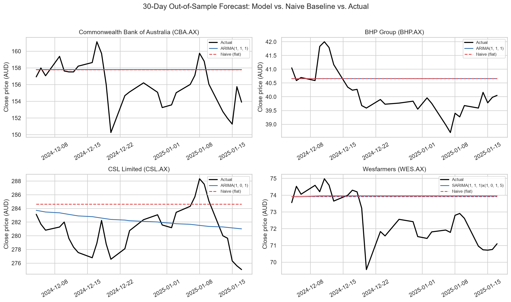
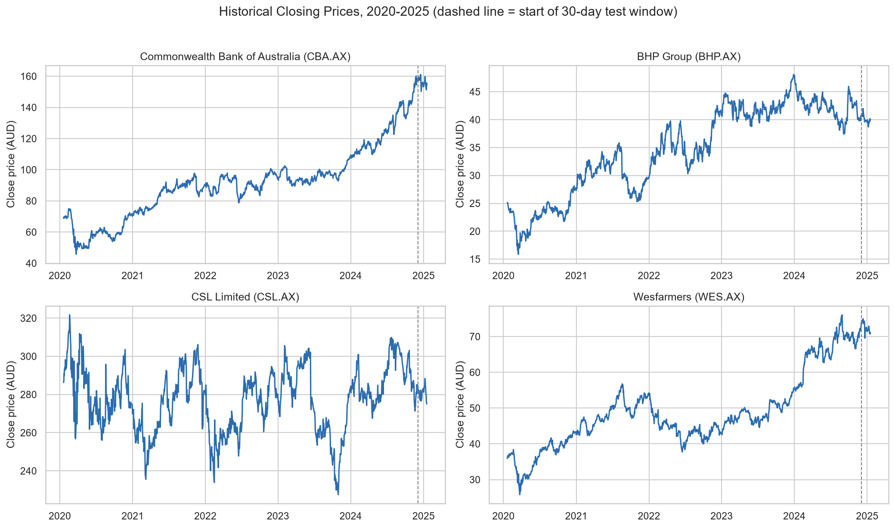

# ASX Blue-Chip Stock Forecasting for Low-Risk Portfolios

**Does time-series forecasting actually add value for a risk-averse investor — or is "assume no change" just as good?**

A time-series forecasting case study using five years of daily price data from four ASX blue-chip stocks, built to test a claim rather than assume it: that recent price history can meaningfully forecast near-term stock movement.

---

## The Business Problem

Risk-averse investors — people saving for retirement, education, or a home deposit — want stable, predictable returns rather than high-risk speculation. Blue-chip ASX companies are the conventional low-risk choice: large, established, heavily analysed. But "stable" and "forecastable" are not the same thing, and a data-driven investor should be able to test the difference rather than assume it.

**The business question:** using five years of daily closing prices for four ASX blue-chips across different sectors, can ARIMA/SARIMA forecasting reliably predict near-term price movement — and does it actually beat the simplest possible alternative: assuming tomorrow's price equals today's?

| Ticker | Company | Sector |
|---|---|---|
| CBA.AX | Commonwealth Bank of Australia | Banking & financial services |
| BHP.AX | BHP Group | Mining & natural resources |
| CSL.AX | CSL Limited | Healthcare & biotechnology |
| WES.AX | Wesfarmers | Diversified retail & industrial |

## My Approach

1. **Test each price series for stationarity** (Augmented Dickey-Fuller test) and difference where needed.
2. **Select ARIMA or SARIMA order** using ACF/PACF diagnostics — SARIMA for Wesfarmers, which shows a structural weekly seasonal pattern tied to its retail business.
3. **Hold out the final 30 trading days as a genuine test set.** The model is trained only on data before this window, then forecasts it blind — this is the step most "beginner" ARIMA tutorials skip, and skipping it makes any accuracy claim untrustworthy.
4. **Compare against a naive baseline** — a flat forecast at the last known price — for every stock, to answer the real question: does the model add value, or does it just look sophisticated?

## Key Findings

| Ticker | Model | Beats a "no change" baseline over 30 days? |
|---|---|---|
| CBA | ARIMA(1,1,1) | No |
| BHP | ARIMA(1,1,1) | No (effectively tied) |
| CSL | ARIMA(1,0,1) | **Yes — ~26% lower forecast error** |
| WES | SARIMA(1,1,1)(1,0,1,5) | No |

**The honest finding:** for three of the four stocks, the forecasting model doesn't outperform simply assuming no price change. That's not a modelling failure — it's evidence that these blue-chips behave like efficiently-priced assets, which is actually consistent with them being sound low-risk holdings. **CSL is the exception**, where the model showed a real, out-of-sample edge — a genuinely useful result precisely because it didn't show up everywhere.

## Why This Matters More Than It Looks

Most tutorial-style ARIMA projects report accuracy on the same data the model was trained on, which overstates how good the forecast really is. This analysis deliberately tests each model on a held-out month it never saw during training, and benchmarks it against the simplest possible alternative. **A model that can't beat "no change" isn't adding value, no matter how good its statistical fit looks on paper** — and being willing to report that honestly, stock by stock, is the more useful skill for a business audience than a chart that only shows the model's best side.

## Business Recommendations

1. **Don't treat ARIMA/SARIMA forecasts on CBA, BHP or WES as a trading edge** — for these three, the data supports monitoring and trend-tracking, not a predictive advantage over a flat-price assumption.
2. **CSL's result is worth a second look**, not a dismissal — despite having the largest raw forecast error (a side-effect of its higher share price, not weaker modelling), it's the one stock where price history carried real forecastable signal.
3. **Combine this with fundamentals, not price history alone** — macroeconomic drivers (interest rates, commodity prices, sector-specific policy) aren't in this model and matter for a genuine low-risk allocation decision.

## Limitations

- Single 30-day holdout per stock — a rolling-window backtest across many periods would be more robust than one test window.
- No macroeconomic or company-fundamental variables (interest rates, earnings, Beta) — price history only.
- Model orders chosen via ACF/PACF inspection, not an automated search.
- Five years of data spans the COVID-19 shock and recovery — an unusually volatile stretch that may not represent typical market conditions.

Full methodology, results table and references: **[executive_summary.md](executive_summary.md)**.

## Tools & Skills

`Python` (pandas, statsmodels, matplotlib) · ARIMA/SARIMA time-series forecasting · stationarity testing & model diagnostics · out-of-sample validation & baseline benchmarking · translating a statistical result into an honest business recommendation.

## Repository Contents

| File | Description |
|---|---|
| [`stock_forecasting_analysis.ipynb`](stock_forecasting_analysis.ipynb) | Full analysis: stationarity tests, model fitting, out-of-sample evaluation, charts |
| [`executive_summary.md`](executive_summary.md) | Full write-up: methodology, results table, honest interpretation, limitations, references |
| `bhp_close_2020-2025.csv`, `cba_close_2020-2025.csv`, `csl_close_2020-2025.csv`, `wes_close_2020-2025.csv` | Daily closing price data (AUD), 2020-01-20 to 2025-01-17, source: Yahoo Finance |

---

*Coursework project — Master of Business Analytics, Kaplan Business School. Data: Yahoo Finance, daily closing prices for four ASX-listed companies.*
